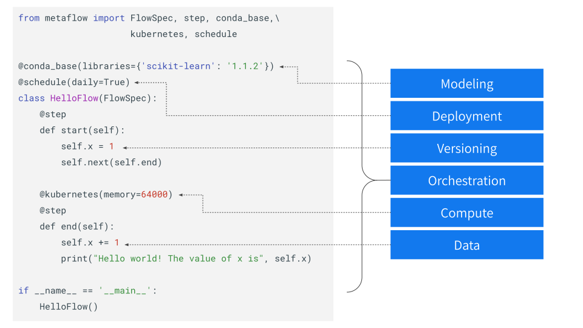
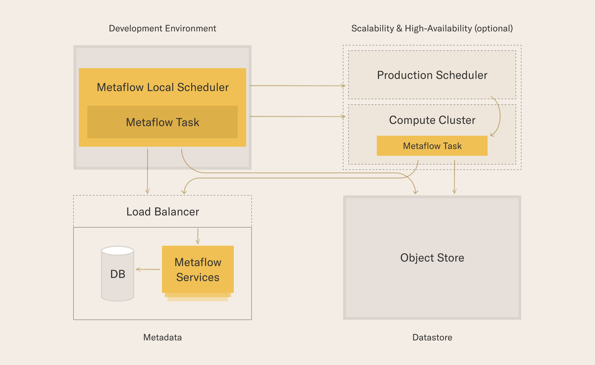

import CollapsibleContent from '../../../src/components/CollapsibleContent';

# Metaflow on EKS

### Introduction

Metaflow is a python library that makes it easy to develop, deploy and operate data-intensive applications, commonly in the data science, ML, and AI space. It was originally conceived at Netflix and is open source under the [Apache License, Version 2.0](https://github.com/Netflix/metaflow/blob/master/LICENSE)

### Key Features and Benefits

Metaflow provides a unified API to the whole infrastructure that is required to execute data science and AI/ML projects from prototype to production. The following concepts are first-class citizens of Metaflow.

1. **Modeling**: Metaflow makes dependencies (python libraries) available in a [reliable and reproducible manner](https://docs.metaflow.org/scaling/dependencies).
2. **Deployment**: Metaflow supports production grade deployments to [workflow orchestrators](https://docs.metaflow.org/production/scheduling-metaflow-flows/introduction) such as Argo Workflows, etc.
3. **Versioning**: Metaflow [keeps track of flows, runs, artifacts, etc.](https://docs.metaflow.org/metaflow/basics#artifacts) which can be later analysed via the Client API.
4. **Orchestration**: [Constructing workflows](https://docs.metaflow.org/metaflow/basics) is human-friendly and testable locally.
5. **Compute**: Metaflow leverages [kubernetes (among other compute platforms) for scalability](https://docs.metaflow.org/scaling/introduction).
6. **Data**: Metaflow provides patterns for [accessing external data from blob stores, warehouses and lakes, etc.](https://docs.metaflow.org/scaling/data)

### Why Use it?

Metaflow is ideal for modern businesses which are eager to utilize data science and ML, eliminating the need to rely on a medley of point solutions and custom systems. The foundation of a robust & well-defined architecture, provided by Metaflow, helps data scientists and ML engineers alike in iterating quickly as well as deploying confidently. While originally created at Netflix, Metaflow is used and trusted by a plethora of companies spanning a wide variety of domains such as:

- Healthcare, Biotech and Medical Devices
- Financial Services and Fintech
- Logistics and Supply Chain
- Software and Technology
- E-commerce and Online Marketplace
- Energy and Sustainable Technology
- Entertainment and Digital Media
- Manufacturing and Engineering

See https://outerbounds.com/stories for in-depth case-studies.

:::info
*Metaflow is also compatible with*:
- the [JARK stack](./jark.md) i.e. Jupyter, Argo, Ray, and Kubernetes
- the [Airflow](https://docs.metaflow.org/production/scheduling-metaflow-flows/scheduling-with-airflow#pushing-a-flow-to-production) orchestrator
- Other compute targets such as [AWS Batch](https://docs.metaflow.org/scaling/remote-tasks/aws-batch) and [Slurm](https://www.youtube.com/watch?v=qP-DKn3U5LI)
:::

### Metaflow on Kubernetes

Deploying Metaflow on EKS allows one to benefit from the following (among others):
- [centralized experiment tracking and sharing via the Client API](https://docs.metaflow.org/metaflow/client)
- [scalable computation](https://docs.metaflow.org/metaflow/scaling-out-and-up) via the elasticity and flexibility of Kubernetes
- reliable and reproducible [dependency management](https://docs.metaflow.org/metaflow/dependencies)
- [production grade deployments](https://docs.metaflow.org/going-to-production-with-metaflow/scheduling-metaflow-flows) via orchestrators such as Argo workflows, etc.

#### Shared Mode Architecture

Metaflow follows a shared-mode architecture with a mix of **required** and **optional** services.

Required Services:
1. **Development Environment**: installation, configuration and access to cloud credentials
2. **Metaflow Service**: tracking metadata for executions, artifacts and offering a user-experience
3. **Datastore**: persistence layer for storing artifacts, snapshotting the user's code package and dependencies, etc.

Optional Services:
1. **Compute Cluster**: elastically scalable compute backend such as K8s and AWS Batch
2. **Production Scheduler**: highly available and battle tested schedulers such as Argo Workflows, Airflow, AWS Step functions, etc.

The installation and deployment instructions for Metaflow on EKS are [here](https://docs.outerbounds.com/engineering/deployment/aws-k8s/deployment/).

---
